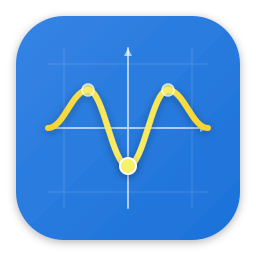

<p align="center">
  
</p>

<h1 align="center">Grafito Open</h1>

<p align="center">
  <a href="https://github.com/Diez111/Grafito-Open/releases"></a>
  <a href="LICENSE"></a>
  <a href="https://www.rust-lang.org"></a>
  <a href="https://github.com/Diez111/Grafito-Open/stargazers"></a>
  <a href="https://github.com/Diez111/Grafito-Open/actions"></a>
</p>

<p align="center">
  <b>Geometría interactiva, álgebra computacional, estadística y cálculo &mdash; acelerados por GPU.</b><br />
  Construido en Rust con WebGPU (wgpu). Más de 50 comandos CAS, CAS simbólico nativo, 11 operaciones de álgebra lineal, 4 compute shaders WGSL, exportación a PNG/PDF/LaTeX.
</p>

---

> :uk: This document is also available in [English](README.en.md).

## Tabla de contenidos

- [¿Por qué Grafito Open?](#por-qu%C3%A9-grafito-open)
- [Características](#caracter%C3%ADsticas)
  - [Canvas 2D interactivo](#canvas-2d-interactivo)
  - [Motor matemático (grafito-geometry)](#motor-matem%C3%A1tico-grafito-geometry)
  - [Geometría 3D](#geometr%C3%ADa-3d)
  - [Estadística y probabilidad](#estad%C3%ADstica-y-probabilidad)
  - [Compute shaders GPU (WGSL)](#compute-shaders-gpu-wgsl)
  - [UI / UX](#ui--ux)
  - [Exportación](#exportaci%C3%B3n)
- [Instalación](#instalaci%C3%B3n)
- [Primeros pasos](#primeros-pasos)
- [Arquitectura](#arquitectura)
- [Referencia de comandos](#referencia-de-comandos)
- [Desarrollo](#desarrollo)
- [Tests y calidad](#tests-y-calidad)
- [Contribuir](#contribuir)
- [Licencia](#licencia)

---

## ¿Por qué Grafito Open?

Grafito es un graficador matemático interactivo escrito desde cero en Rust. A diferencia de alternativas de escritorio, expone un CAS simbólico nativo (sin dependencias de `evalexpr` ni SymPy), álgebra lineal avanzada (autovalores, SVD, Cholesky), y un motor de compute shaders WGSL que evalúa **50 opcodes** en paralelo en GPU. El proyecto apunta a superar a GeoGebra en cobertura matemática, rendimiento y transparencia de código.

- **~61.000 líneas de Rust** en 6 crates
- **587 tests** (unit + integration)
- **0 bloques `unsafe`** en código de producción
- **CI completo** con fmt, clippy `-D warnings`, tests, docs

## Características

### Canvas 2D interactivo

- **36 tipos de objetos geométricos**: puntos, líneas (segmento/rayo/vector/infinita), círculos, polígonos, elipses, parábolas, hipérbolas rotadas, funciones, cónicas avanzadas, texto
- **Restricciones constructivas** (midpoint, perpendicular, parallel, point-on-object) y **numéricas** (Levenberg-Marquardt con Jacobianos analíticos: distance, angle, tangent, coincident, horizontal, vertical, equal-length, symmetry)
- **Operaciones booleanas 2D** sobre polígonos (unión, intersección, diferencia, XOR)
- **Snap-to-grid** y **snap-to-features** (curvas, intersecciones)
- **5 niveles de undo/redo** con persistencia del documento

### Motor matemático (`grafito-geometry`)

314 funciones públicas organizadas en módulos:

| Módulo | Cobertura |
|--------|-----------|
| `ast` | Parser con ~50 variantes (Const, Var, Add/Mul/Div/Pow, trig directa e inversa, hiperbólicas, comparaciones, piecewise, Re/Im/Arg/Conj, Bessel J/Y/I, Gamma, Erf, Erfc, Digamma, sec/csc/cot, atan2, mod, sign, heaviside, cbrt, clamp, sum, product) |
| `symbolic` | **CAS nativo** (sin evalexpr): derivación simbólica con regla de cadena, integración polinómica/trig/exp/ln, simplificación algebraica, solve (lineal, cuadrática, **Cardano** para cúbica, **Ferrari** para cuártica, Newton numérico para grado >4), Taylor, limit, factor, expand, substitute |
| `matrices` | add/sub/mul/det/inverse/trace + **eigenvalues, eigenvectors, SVD, LU, QR, Cholesky, rank, null_space, condition_number, Frobenius/spectral norm** (sobre nalgebra) |
| `statistics` | media, mediana, moda, varianza, std-dev, min, max, range, quantiles, IQR, covarianza, correlación, regresión lineal/polinomial/exponencial/logarítmica/potencia, histogram, boxplot, frequency table |
| `distributions` | normal PDF/CDF/quantile, binomial PMF/CDF, Poisson PMF/CDF, Student-t PDF, Chi², ANOVA, Beta, Gamma, IC, ChiSqTest |
| `analysis` | Root, Extremum, Inflection, YIntercept, XIntercept, ArcLength, CurvatureAt, TangentAt, NormalAt, VolumeOfRevolution, SurfaceOfRevolution, Analyze |
| `ode` | Euler, RK4, **RK45 adaptativo** (RKF45 con control de paso), sistemas, **backward Euler** con Newton-Jacobian para stiff |
| `boolean` | Operaciones booleanas 2D sobre polígonos via `geo` crate |
| `fractals` | Mandelbrot, Julia (dendrite/siegel/galaxy), BurningShip, Tricorn, Newton |
| `attractors` | Lorenz, Rössler, Thomas, Aizawa, Chen, Halvorsen, Dadras, Chua, Sprott, Three-scroll (RK4 integration) |
| `special_functions` | gamma, ln_gamma, beta, bessel_j/y/i, erf, erfc, digamma |
| `special_curves` | cardioid, rose, espirales (Archimedean, logarithmic), Lissajous, epi/hipocicloide, **astroide, deltoide, tractriz, braquistocrona** |
| `conformal` | 13 mapeos algebraicos (Inversion, Power, Exp, Log, trig, Joukowski, Möbius), complex_expr parser, domain coloring |
| `dd` | **Aritmética double-double** (precisión extendida) — ventaja única vs GeoGebra |
| `precision` | Constantes y utilidades numéricas |

### Geometría 3D

- Punto 3D, segmento 3D
- Sólidos: esfera, cubo, pirámide, cono, cilindro, toro
- **MoebiusStrip**, **Superficie paramétrica 3D** `z = f(x,y)`, **Curva paramétrica 3D**
- **Attractor3D** con proyección 2D del orbit integrado
- **HyperSurface4D** (rebanada de 4D)
- Cámara con orbit/pan/zoom

### Estadística y probabilidad

Regresión lineal/polinomial/exponencial/log/potencia con R², distribuciones normal/binomial/Poisson/Student-t, histogram interactivo, boxplot, frequency table, ANOVA, test Chi², intervalos de confianza. Todo accesible desde comandos CAS.

### Compute shaders GPU (WGSL)

Cuatro pipelines de cómputo en `crates/grafito-render/src/`:

| Pipeline | Uso | Opcodes |
|----------|-----|---------|
| `function_compute.wgsl` | Evaluar `y = f(x)` en grilla 1D | 50 |
| `implicit_compute.wgsl` | Evaluar `f(x,y) = c` para marching squares | 50 |
| `parametric_compute.wgsl` | Curvas 2D/3D y superficies paramétricas | 50 |
| `vector_compute.wgsl` | Campo vectorial 2D `(P(x,y), Q(x,y))` | 50 |

**50 opcodes soportados** en GPU (vs 22 antes de v1.0.0): aritmética completa, trig directa/inversa, hiperbólicas directas/inversas, sec/csc/cot, atan2, mod, sign, heaviside, cbrt, round, log2, log10, exp2, clamp, **6 comparaciones (Lt/Gt/Le/Ge/Eq/Ne → 0/1)**. Esto permite graficar en GPU expresiones como `sin(x)*mod(x,2)`, `atan2(y,x)`, `heaviside(sin(x))`, comparaciones como `piecewise(x<0, -1, 1)`, etc.

Patrón de cada pipeline:
1. Compilación AST→bytecode (RPN) en CPU
2. Dispatch `pass.dispatch_workgroups(...)` con workgroup_size óptimo (64 para 1D, 16×16 para 2D)
3. Readback asíncrono
4. CPU-side marching squares o evaluación de streamlines
5. Caché con claves `(expresión, dominio, variables, calidad)` y padded/snapped view region para invalidar menos en pan/zoom

### UI / UX

- **50 herramientas** en toolbar agrupadas (Select, Point, Line, Circle, Polygon, Function, 3D, Attractor, Fractal, Histogram, Root, Extremum, etc.)
- **Paleta de comandos** con fuzzy match (Ctrl+K)
- **Panel de álgebra** interactivo
- **Undo/redo** con snapshot del documento
- **Tooltips** y **ghost preview** antes de commit
- **Toast** para feedback de errores/mensajes CAS
- **Tema dark/light** con design tokens centralizados
- **Multi-idioma** (español por defecto, comandos aceptan aliases `Function/func`)

### Exportación

- **JSON** (round-trip completo del documento)
- **SVG** (todos los objetos 2D)
- **PNG** (raster CPU con Bresenham + midpoint circles)
- **PDF** (PDF 1.4 válido, content stream con primitivas)
- **LaTeX** (standalone `tikz`/`pgfplots` con points, lines, circles, polygons, functions, ellipses, text)

## Instalación

<p><details><summary><b>Linux &mdash; Debian / Ubuntu (.deb)</b></summary>

```bash
wget https://github.com/Diez111/Grafito-Open/releases/latest/download/grafito_amd64.deb
sudo dpkg -i grafito_amd64.deb
```
</details></p>

<p><details><summary><b>Windows &mdash; .exe portátil</b></summary>

1. Descargá el `.exe` desde [Releases](https://github.com/Diez111/Grafito-Open/releases)
2. Ejecutalo directamente. No requiere instalación.
</details></p>

<p><details><summary><b>Desde el código fuente</b></summary>

Requisito: [Rust 1.78+](https://rustlang.org), drivers GPU con soporte Vulkan/Metal/DX12.

```bash
git clone https://github.com/Diez111/Grafito-Open.git
cd Grafito-Open
cargo build --release -p grafito-app
./target/release/grafito      # Linux/macOS
./target/release/grafito.exe  # Windows
```

Para soporte GPU completa, en Linux asegurate de tener `libvulkan1`, `mesa-vulkan-drivers` y drivers de tu GPU instalados.
</details></p>

## Primeros pasos

1. Abrí Grafito
2. En la barra de entrada (parte inferior) escribí:

```
A = (1, 2)
B = (4, 6)
Line[A, B]
```

Verás el punto A, el punto B y la recta que los une. Ahora intentá:

```
Circle[(0, 0), 2]
Function[sin(x)]
Function[x^2 - 2*x + 1]
Parabola[(0, 0), 3]                  // vértice en (0,0), parámetro p=3
Ellipse[(0, 0), 3, 2]                // centro, semi-eje a, semi-eje b
PolarCurve[1 + cos(t), 0, 2*pi]      // cardioide
ImplicitCurve[x^2 + y^2, 4]          // círculo implícito
Mandelbrot[-2.5, 1.5, -1.5, 1.5]     // fractal
Lorenz[0.1, 0, 0]                    // atractor de Lorenz
```

Para análisis:
```
Analyze[sin(x), -5, 5]               // raíces, extremos, inflexiones
Derivative[x^3, x]                   // "3*x^2" (CAS nativo)
Solve[x^2 - 4, x]                    // ["2", "-2"]
Eigenvalues[[2,0],[0,3]]             // "[(2, 0), (3, 0)]"
SVD[[1,2],[3,4]]                     // descomposición
TangentAt[sin(x), 1]                 // línea tangente
ArcLength[sin(x), 0, pi]             // longitud de arco
VolumeOfRevolution[x^2, 0, 1]        // volumen π/3
```

## Arquitectura

Workspace con 6 crates, dependencias acíclicas y mínimas:

```
grafito-geometry  (sin dependencias internas) → AST, CAS, matrices, stats, ODE, fractals, conformal
        ↑               ↑
grafito-core      grafito-command          → Document, GeoObject (36 variants), constraints, sampling
        ↑               ↑                       GPU sampling cache, numeric solver
grafito-render    grafito-ui               → WGSL compute pipelines, GPU canvas
        ↑               ↑                       egui toolbar, theme, command palette
        └──── grafito-app ────┘              → run_app() entry point
```

| Crate | Líneas | Responsabilidad |
|-------|--------|-----------------|
| `grafito-geometry` | ~14.000 | Motor matemático puro (AST, CAS, matrices, estadística, ODE, fractales, complejos) |
| `grafito-core` | ~6.000 | Modelo de documento, restricciones, índice espacial, sampling cache |
| `grafito-render` | ~4.000 | Pipelines WGSL compute + render GPU |
| `grafito-command` | ~5.000 | Procesador compartido de comandos de texto (process_input) |
| `grafito-ui` | ~5.000 | Componentes egui (toolbar, command palette, theme, tokens) |
| `grafito-app` | ~8.000 | Punto de entrada desktop, ensambla UI + render + eventos |

Detalles en [`docs/commands.md`](docs/commands.md) y [`CHANGELOG.md`](CHANGELOG.md).

## Referencia de comandos

Más de **395 comandos** CAS reconocidos, incluyendo aliases español/inglés. Ejemplos por categoría:

- **Geometría**: `Point[]`, `Line[]`, `Segment[]`, `Ray[]`, `Vector[]`, `Circle[]`, `Polygon[]`, `Ellipse[]`, `Parabola[]`, `Hyperbola[]`, `Arc[]`
- **Funciones**: `Function[]`, `Function[piecewise(x<0, x^2, x>=0, sqrt(x))]`
- **Paramétricas/Polares/Implícitas**: `ParametricCurve[]`, `PolarCurve[]`, `ImplicitCurve[]`
- **Avanzado**: `Fractal[]`, `Mandelbrot[]`, `Julia[]`, `Lorenz[]`, `Rossler[]`, `Aizawa[]`, `Chen[]`, `Halvorsen[]`, `Dadras[]`, `Chua[]`, `Sprott[]`
- **3D**: `Point3D[]`, `Sphere[]`, `Cube[]`, `Pyramid[]`, `Cone[]`, `Cylinder[]`, `Torus[]`, `Moebius[]`, `Surface3D[]`, `Curve3D[]`
- **Estadística**: `Histogram[]`, `ScatterPlot[]`, `BoxPlot[]`, `Regression[]`, `Mean[]`, `Median[]`, `StdDev[]`, `ANOVA[]`, `ChiSqTest[]`, `Correlation[]`
- **Cálculo**: `Derivative[]`, `Integral[]`, `Limit[]`, `Sum[]`, `Product[]`, `Taylor[]`, `Expand[]`, `Factor[]`, `Simplify[]`, `Substitute[]`
- **Álgebra lineal**: `Determinant[]`, `Inverse[]`, `Eigenvalues[]`, `Eigenvectors[]`, `SVD[]`, `LU[]`, `QR[]`, `Cholesky[]`
- **Restricciones**: `Distance[]`, `Angle[]`, `TangentConstraint[]`, `Coincident[]`, `Horizontal[]`, `Vertical[]`, `EqualLength[]`, `Symmetry[]`
- **Cónicas**: `EllipseByFoci[]`, `ParabolaByFocusDirectrix[]`, `HyperbolaByFoci[]`, `ConicByFivePoints[]`
- **Booleanos**: `PolygonUnion[]`, `PolygonIntersection[]`, `PolygonDifference[]`, `PolygonXor[]`
- **Mapeos conformes**: `ComplexMapping[1/z, I]`, `ComplexMapping[z^2]`, `Joukowski[1+0.1*cos(t)]`
- **Análisis**: `Root[]`, `Extremum[]`, `Inflection[]`, `XIntercept[]`, `YIntercept[]`, `Analyze[]`, `TangentAt[]`, `NormalAt[]`, `ArcLength[]`, `CurvatureAt[]`, `VolumeOfRevolution[]`, `SurfaceOfRevolution[]`

Lista completa y sintaxis en [`docs/commands.md`](docs/commands.md).

## Desarrollo

```bash
# Build release
cargo build --release -p grafito-app

# Verificación completa (CI local)
cargo fmt --all
cargo clippy --workspace --all-targets -- -D warnings
cargo test --workspace
cargo build --workspace --release

# Benchmarks (criterion)
cargo bench -p grafito-core
cargo bench -p grafito-render
cargo bench -p grafito-geometry

# Profiling con puffin
cargo run -p grafito-app --features profile -- --profile
# Conectar puffin_viewer a 127.0.0.1:8585
```

## Tests y calidad

- **587 tests** en el workspace (unit + integration)
- `cargo fmt --check` (CI)
- `cargo clippy --workspace -- -D warnings` (CI)
- `cargo test --workspace` (CI)
- `cargo doc --workspace --no-deps` con `-D warnings` (CI)
- **0 bloques `unsafe`** en código de producción
- 2 TODO conocidos (ninguno crítico)
- Build matrix: x86_64 Linux, x86_64 Windows, x86_64 macOS, aarch64 macOS

## Contribuir

¡Las contribuciones son bienvenidas! Por favor:

1. Fork el proyecto
2. Creá una branch (`git checkout -b feature/mi-feature`)
3. Hacé tus cambios siguiendo las convenciones (Rust 2021, `cargo fmt`, `cargo clippy`)
4. Añadí tests para código nuevo
5. Asegurate que `cargo test --workspace && cargo clippy --workspace -- -D warnings` pase
6. Commit con Conventional Commits (`feat:`, `fix:`, `refactor:`, `docs:`, `test:`)
7. Push y abrí un Pull Request

Ver [`CONTRIBUTING.md`](.github/CONTRIBUTING.md) para más detalles y [`CODE_OF_CONDUCT.md`](.github/CODE_OF_CONDUCT.md).

## Licencia

**GPL-3.0-or-later**. Ver [`LICENSE`](LICENSE) para el texto completo.

```
Grafito Open - GPU-accelerated mathematical graphing calculator
Copyright (C) 2026 Grafito Contributors

This program is free software: you can redistribute it and/or modify
it under the terms of the GNU General Public License as published by
the Free Software Foundation, either version 3 of the License, or
(at your option) any later version.
```

---

<p align="center">
  Hecho con Rust en Argentina · <a href="https://github.com/Diez111/Grafito-Open">Diez111/Grafito-Open</a>
</p>
